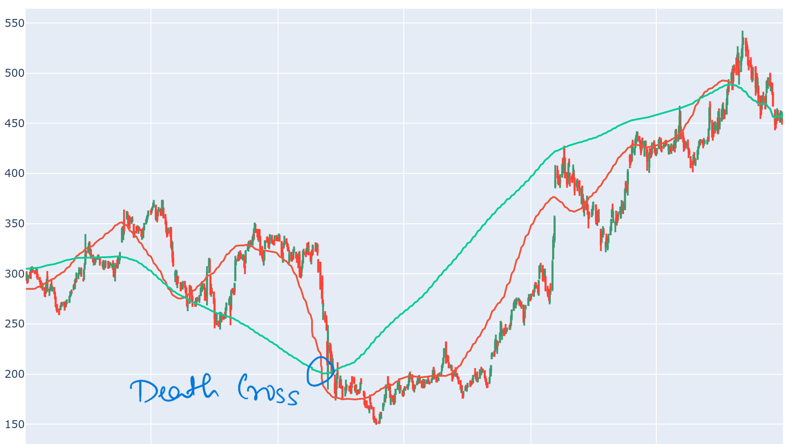
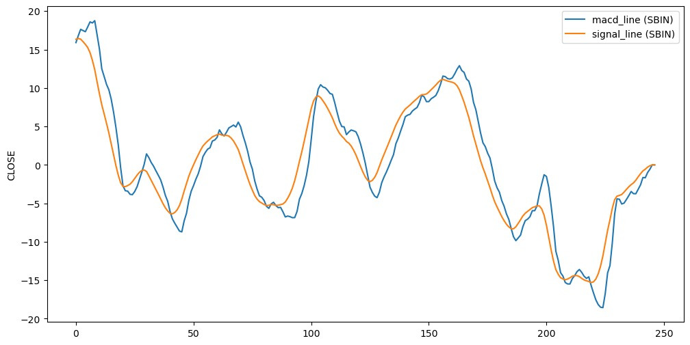
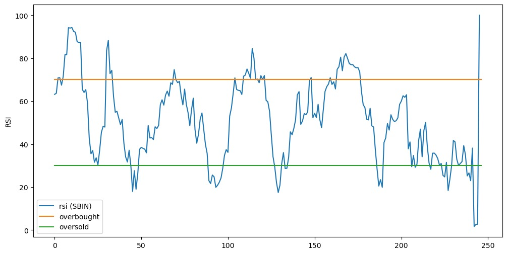
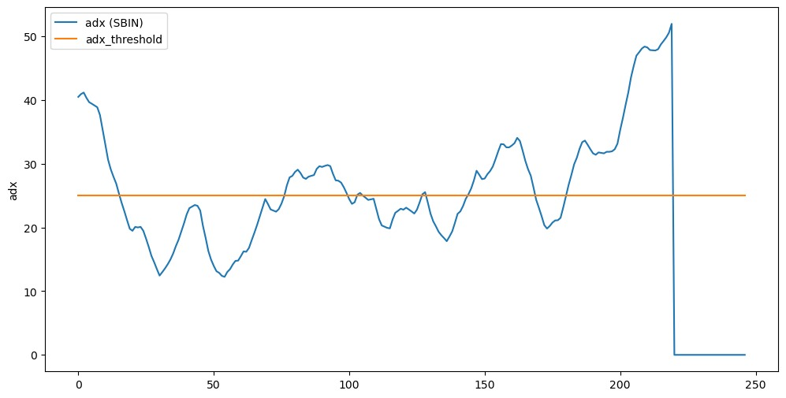
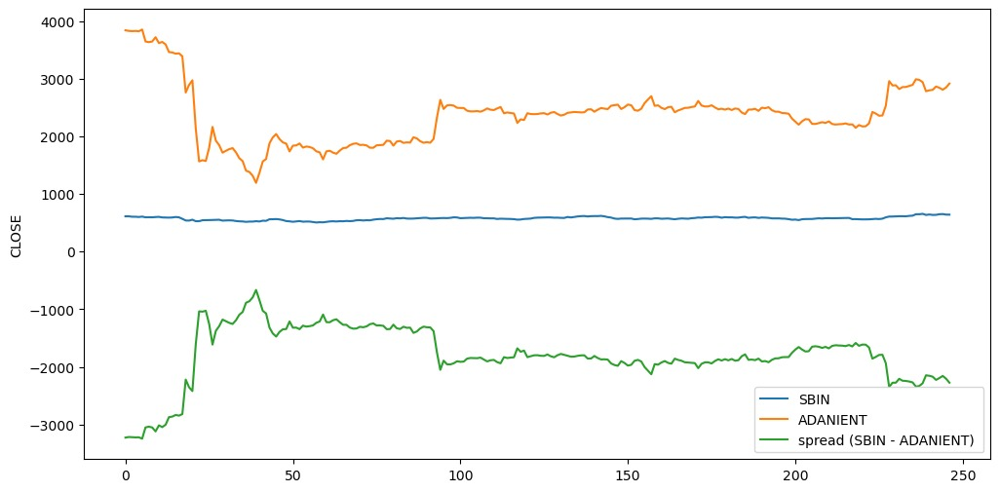
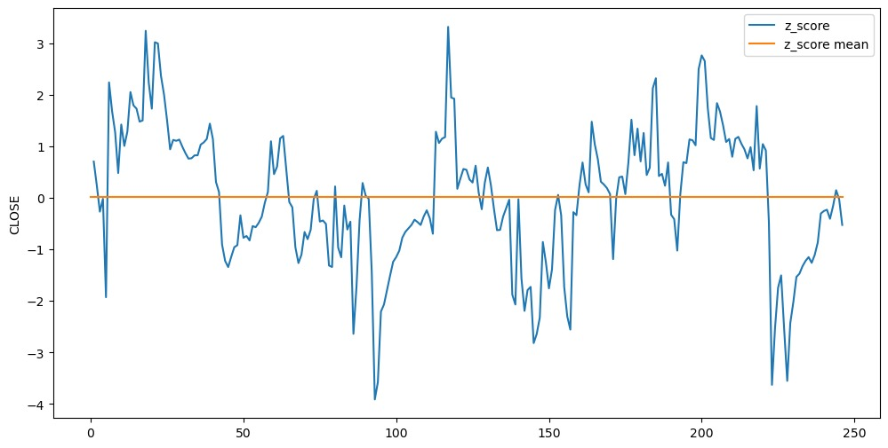

# Trading Strategies

### Basic
This is one of the simplestst strategy. Being the easiest to implement, this will lead to bad trading decisions most of the time. Let us consider a situation where a stock's price increases for n-1 days and then suddenly drops on the nth day, for example increases for a few days by huge amounts before dropping by 1 rupee. This might turnout to be very frequent leading to no buy signals. Similar goes for the converse case.

### DMA 
We can combine different moving averages to get better sense of the trends. For example, we can have a fast moving average (window = 50 days) and a slow moving average (window = 200 days). Now, we can identify significant turning points in the market, such as a death cross. A death cross occurs when the fast moving average crosses below the slow moving average.  
  
This is considered as a good time to sell shares. Another similar turning point is a golden cross, which has the opposite trend with respect to a death cross.

### DMA++
The DMA++ or AMA (Adaptive Moving Average) is one of the best indicators for analyzing short-term market trends as this adapts to the changing market conditions. This leads to more accurate signals, compared to fixed-parameter moving averages. It has a large number of variants, for example: TRAMA, KAMA, etc.

### MACD

 
MACD's ability to measure momentum, detect divergence and generate clear signals make it a standout indicator. However, it is known to give false signals in case of flat trends (no upward or downwards momentum).

### RSI

 
This strategy, despite being very good at trend reversals, has some flaws. If a stock is oversold, RSI does not guarantee that it cannot be more oversold. This can lead to loss in trading. It should rather be used for what it is intended towards, measuring the "STRENGTH" of the trend.

### ADX

 
This is another strength-based indicator which is very reliable for distinguishing trending and non-trending days. It is often depicted by a single line graph which is simple enough to enhance faster decision-making. Usually, 

| ADX Value Range | Trend Strength        |
|-----------------|-----------------------|
| 0-25            | Absent or Weak Trend  |
| 25-50           | Strong Trend          |
| 50-75           | Very Strong Trend     |
| 75-100          | Extremely Strong Trend|

 

### Linear Regression
This machine learning based strategy trains a model over a dataset and makes predictions for future stock prices. It works best for seasonal data as the model predicts prices more accurately and this increases the chances of profit by a huge margin. Using gradiet descent can further improve the performace of the algorithm.

### Pairs

 
 
One interesting aspect of pairs trading is its reliance on statistical analysis and historical relationships between assets. Unlike other trading strategies that focus solely on price movements or fundamental analysis, pairs trading involves quantitative analysis to identify pairs with historically stable relationships.

